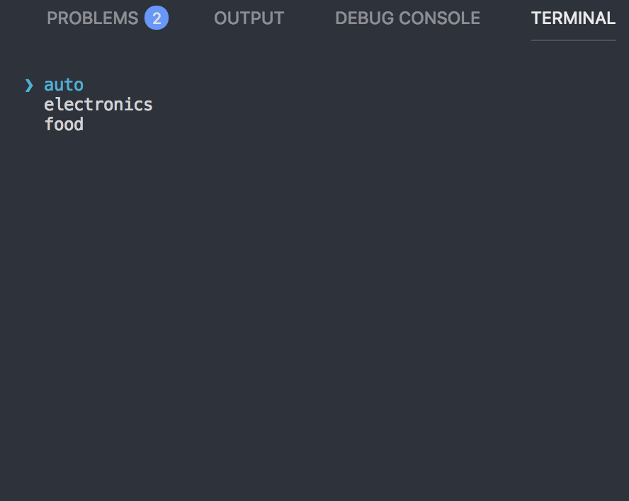
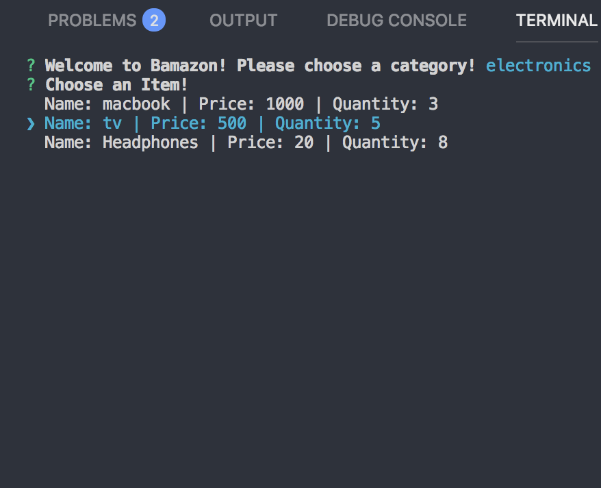
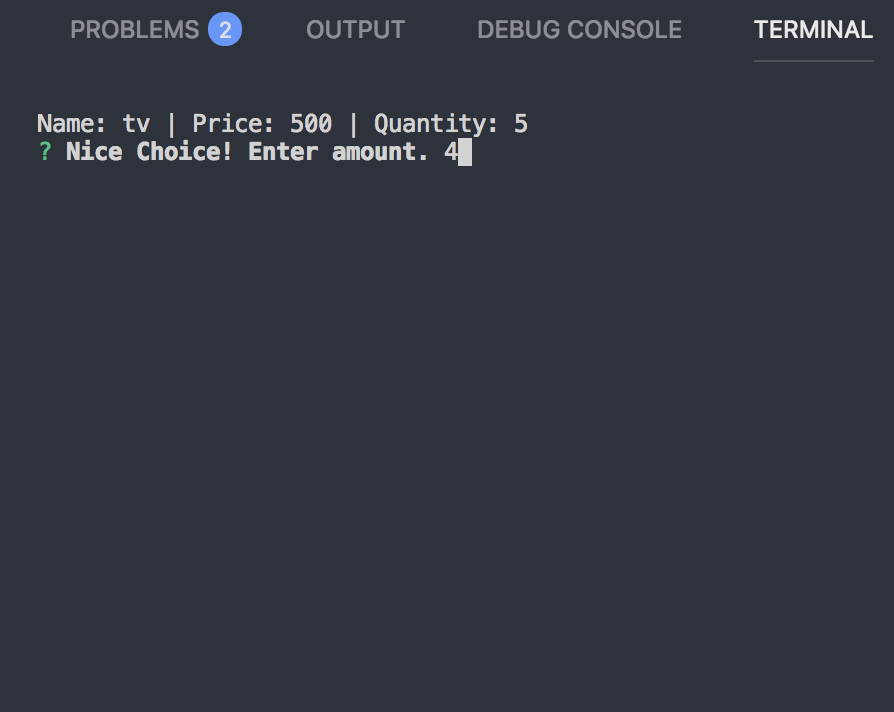
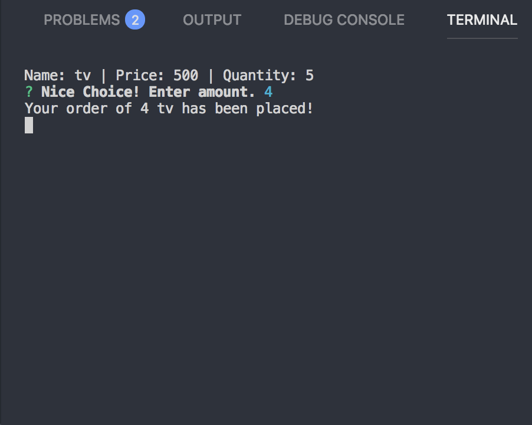
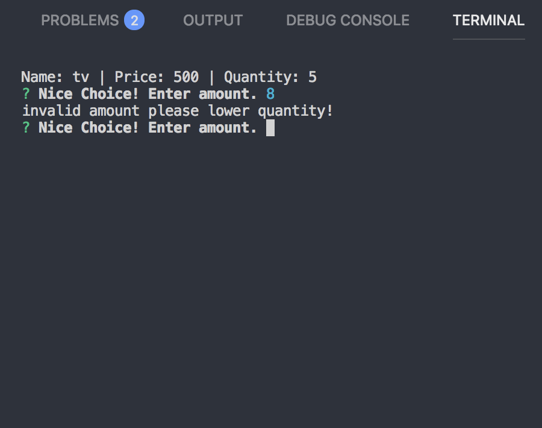

# Bamazon

# User can choose a category (based on current departments in database)

# user is then shown current items in that department with correct data

# once a item has been chosen, user is prompted on how many of the item he/she wants to purchase

# If that number is below stock quantity, purchase goes through updating database

# else, user is told to select a smaller amount

